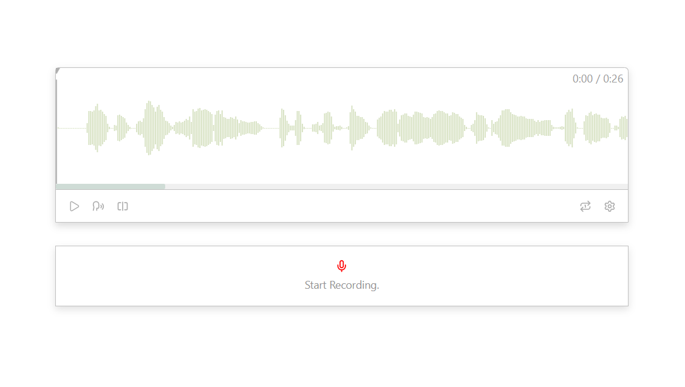

# AnkiCard Shadowing 

## Overview
<b>AnkiCard Shadowing</b> is a custom audio-learning companion for [<b>Anki</b>](https://github.com/ankitects/anki), designed to enhance language acquisition through shadowing practice — listening and speaking simultaneously.
It integrates an interactive waveform player, real-time audio tracking, and minimal controls, allowing users to repeat and shadow native pronunciation efficiently.

## Screenshots
### With Web (for deverloper)


### With Anki
The software is in development

## Core Features
🎧 Waveform-based audio visualization.

⏯️ Play/Pause toggle with progress tracking.

🕒 Real-time current time and total duration display.

⚙️ Easy integration with Anki note templates.

🎨 Clean, responsive UI with SCSS mixins for layout control.


## Project Structure

```bash
├── public                     # public static assets (directly copied)
│   │── favicon.ico            # website icon (shown in the browser tab)
│   └── audios                 # static audio files copied directly on build
│
├── src                        # main source code
│   ├── assets                 # assets that need to be processed by Vite(images, fonts, SVG)
│   ├── components             # reusable Vue components
│   ├── styles                 # global SCSS/CSS, mixins, and variables
│   ├── App.vue                # root component
│   ├── autoImports.d.ts       # auto-import type definitions (vite-plugin-auto-import)
│   ├── components.d.ts        # type definitions for auto-registered components
│   ├── main.ts                # main entry point of the Vue app
│   └── vite-env.d.ts          # environment type definitions for Vite
│
├── index.html                 # root HTML template where the Vue app mounts
├── package-lock.json          # locks dependency versions for consistent builds
├── package.json               # lists dependencies, scripts, and project metadata
├── README.md                  # documentation and setup instructions
├── tsconfig.app.json          # TypeScript configuration specific to the app
├── tsconfig.json              # base TypeScript configuration (extends tsconfig.app.json)
├── package.node.json          # TypeScript configuration specific to the node
└── vue.config.js              # used by Vue CLI, not needed if you’re using Vite
```

## Project setup
...
